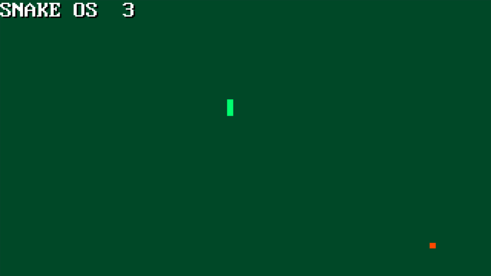

# ! BEWARE ! WIP!!!

# SNAKE-OS

## About
SNAKE-OS is a 32-bit operating system created out of boredom. It is heavily inspired by TETRIS-OS.  



## What i've already done
- Custom made protected mode bootloader
- 320x200x8 graphics mode
- GDT, IDT, and PIC setup
- Timer implementation (`pit.h` / `pit.c`)
- 8x16 font rendering
- Keyboard driver
- Core Snake game

## What do i need to do
- Sprites for Snake, Apple, Background, etc.
- General improvement of graphics.
- Audio driver
- Music and menu


## Requirements
- A modern GCC compiler
- NASM assembler for compiling the bootloader and kernel


## How to run
1. Ensure you have the requirements installed.
2. Clone the GitHub repository:
    ```bash
    git clone https://github.com/DrElectry/SnakeOS.git
    ```
3. Build the project:
    ```bash
    make all
    ```
4. This will generate `floppy.img` which you can:
    - Run in QEMU or any other x86 emulator, or
    - Write to a floppy/USB using dd on Linux or rufus in dd mode on Windows  
      *(abt mac os, i dont know lmao)*


The latest commit had been tested on real hardware.
