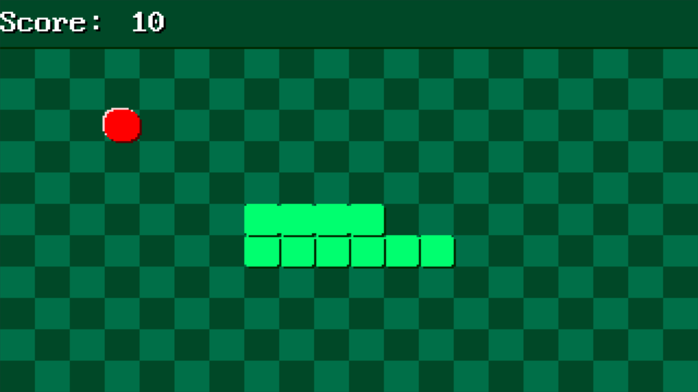

# SNAKE-OS

## About
SNAKE-OS is a 32-bit operating system which is heavily inspired by TETRIS-OS



## Features:
- It's 32-bit (x86)
- Custom made MBR bootloader.
- Double buffered 320x200 8-bit 60 FPS graphics.
- Snake.
- Square waves audio and music.
- Entire OS is only 10 KB in size.

## Controls
-   WASD to move.
-   ESC ingame to switch back to menu.

## Requirements
- A modern GCC compiler.
- NASM assembler.

## How to run
1. Ensure you have the requirements installed.
2. Clone the GitHub repository:
    ```bash
    git clone https://github.com/DrElectry/SnakeOS.git
    ```
3. Build the project:
    ```bash
    make all
    ```
4. This will generate `floppy.img` which you can:
    - Run in QEMU or any other x86 emulator, or
    - Write to a floppy/USB using dd on Linux or rufus in dd mode on Windows  
      *(abt mac os, i dont know lmao)*

    - If you want to run it in QEMU, use this command.
    ```bash
    qemu-system-i386 -audiodev pa,id=snd0 -machine pcspk-audiodev=snd0 -fda floppy.img
    ```
## Important to know
- The latest commit had been tested on real hardware.
- The OS uses the PC speaker, which may not work on all hardware.ss
