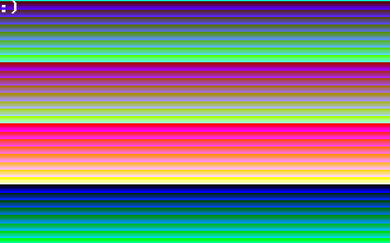

!!! WORK IN PROGRESS !!!

i got heavily inspired by jdh's TETRIS OS, so i decided to improve my osdev knowledge by writing a copycat, the SNAKE OS.

i currently implemented:
  my own 32bit bootloader.
  vga setup and stuff.
  gdt + idt + pic.
  PIT and ISR's are begging to emerge.
  malloc and memcpy for vga double buffering.

if you decide to compile it, you will see scrolling pallete test and text :) in the top left corner.

have fun!
